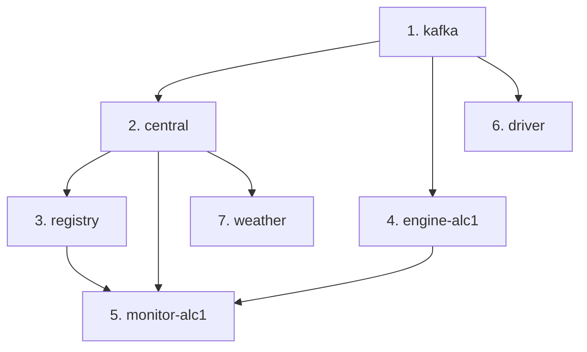

# EVCharging — Especificación Técnica y Plan de Dockerización

> **Autor**: Danil Launov Draganov  
> **Asignatura**: Sistemas Distribuidos — Universidad de Alicante — Curso 2025/26  
> **Fecha del documento**: 2026-09-26

---

## 1. Visión General del Sistema

EVCharging es un sistema distribuido de gestión de puntos de recarga de vehículos eléctricos. Originalmente se desplegó en 3 máquinas (1 host Windows + 2 VMs Linux), usando una combinación de:

- **Apache Kafka** como bus de mensajería asíncrona.
- **Sockets TCP con SSL/TLS** para la comunicación Monitor ↔ Central.
- **APIs REST con HTTPS** (Flask + certificados autofirmados) para Registry ↔ Central, Weather ↔ Central y el Frontend.
- **SQLite** como base de datos embebida en la Central.
- **Cifrado Fernet** (simétrico) para proteger el payload de los mensajes Kafka y Socket.
- **Sistema de Tokens** para autenticación de los Charge Points.

---

## 2. Arquitectura Distribuida Original (VMs)

```
┌─────────────────────────────────────────────────────────┐
│         Host Windows (192.168.56.1)                     │
│                                                         │
│  ┌──────────────┐  ┌──────────────┐  ┌───────────────┐  │
│  │ Apache Kafka  │  │  EV_Central  │  │  Frontend     │  │
│  │  (broker)     │  │  (API+Socket │  │  (index.html) │  │
│  │  puerto 9092  │  │   +Kafka)    │  │  HTTPS :5001  │  │
│  └──────────────┘  │  SSL :65000  │  └───────────────┘  │
│                     │  HTTPS :5001 │                     │
│                     │  SQLite DB   │                     │
│                     └──────────────┘                     │
└─────────────────────────────────────────────────────────┘

┌─────────────────────────────────────────────────────────┐
│        VM Debian (192.168.56.120)                        │
│                                                         │
│  ┌──────────────┐  ┌──────────────┐  ┌───────────────┐  │
│  │  EV_CP_E     │  │  EV_CP_M     │  │  EV_Weather   │  │
│  │  (Engine)    │  │  (Monitor)   │  │               │  │
│  │  Kafka +     │  │  SSL Socket  │  │  REST client  │  │
│  │  Socket      │  │  → Central   │  │  → Central    │  │
│  │  :65001      │  │              │  │  OpenWeather   │  │
│  └──────────────┘  └──────────────┘  └───────────────┘  │
└─────────────────────────────────────────────────────────┘

┌─────────────────────────────────────────────────────────┐
│        VM Linux Mint (192.168.56.110)                    │
│                                                         │
│  ┌──────────────┐  ┌──────────────┐                     │
│  │  EV_Registry  │  │  EV_Driver   │                     │
│  │  HTTPS :5000  │  │  Kafka       │                     │
│  │  REST API     │  │  productor + │                     │
│  │  → Central    │  │  consumidor  │                     │
│  └──────────────┘  └──────────────┘                     │
└─────────────────────────────────────────────────────────┘
```

---

## 3. Módulos — Especificación Detallada

### 3.1 EV_Central (`EV_Central.py` — 753 líneas)

**Rol**: Servidor central. Orquesta todo el sistema.

**Componentes que ejecuta simultáneamente** (hilos):
1. **Servidor SSL/TLS Socket** (puerto configurable, ej. 65000) — acepta conexiones de Monitores.
2. **Consumidor Kafka `driver_central`** — recibe peticiones REQUEST de drivers.
3. **Consumidor Kafka `cp_central`** — recibe mensajes CARGANDO/TICKET/EVENT de engines.
4. **API REST Flask con HTTPS** (puerto 5001) — sirve frontend + endpoints internos.

**Dependencias**:
- `database_manager.py` (SQLite)
- `templates/index.html` (frontend)
- `server_cert.pem`, `server_key.pem` (certificados SSL)
- Kafka broker

**Argumentos CLI**: `python3 EV_Central.py <puerto_escucha> <broker_ip> <broker_puerto>`

**Endpoints REST**:
| Método | Ruta | Descripción |
|--------|------|-------------|
| GET | `/` | Sirve el frontend HTML |
| GET | `/cps` | Lista todos los CPs con estado, precio, token, info de carga en tiempo real |
| POST | `/api/internal/registro-cp` | Recibe datos de registro desde Registry (interno) |
| POST | `/api/weather` | Recibe alertas de clima desde EV_Weather |
| GET | `/api/logs` | Devuelve historial de auditoría (max 20 entradas) |
| POST | `/cps/<cp_id>/parar` | Orden de parada manual desde frontend |
| POST | `/cps/<cp_id>/reanudar` | Orden de reanudación desde frontend |
| POST | `/cps/<cp_id>/revocar` | Revocación de credenciales desde frontend |

**Topics Kafka**:
| Topic | Rol en Central |
|-------|---------------|
| `driver_central` | Consumidor (recibe REQUEST de drivers) |
| `central_driver` | Productor (envía AUTORIZADO/DENEGADO/CARGANDO_DRIVER/TICKET/ERROR a drivers) |
| `cp_central` | Consumidor (recibe CARGANDO/TICKET/EVENT de engines) |
| `central_cp` | Productor (envía START/PARAR_CP/REANUDAR_CP a engines) |

**Protocolo Socket (Monitor ↔ Central)**:
- Empaquetado binario: `STX(0x02) + payload + ETX(0x03) + LRC`
- Respuestas: `ACK(0x06)` o `NACK(0x15)`
- Mensajes: `AUT,<cp_id>,<token>` | `STAT,<cp_id>,OK/KO` | `EVENT,<cp_id>,AVERIADO`
- SSL/TLS obligatorio (server-side certificates)
- Payload cifrado con Fernet tras autenticación

**Estados de un CP**:
`DESCONECTADO` → `ACTIVADO` → `SUMINISTRANDO` → `ACTIVADO`  
`ACTIVADO` → `PARADO` (manual/clima) → `ACTIVADO`  
`ACTIVADO` → `AVERIADO` (fallo engine)  
`ACTIVADO` → `NO_AUTORIZADO` (credenciales revocadas)

---

### 3.2 EV_Registry (`EV_Registry.py` — 72 líneas)

**Rol**: Servicio de registro y generación de credenciales para CPs.

**Funcionalidad**:
1. Recibe POST `/registro` con `{cp_id, ubicacion}` desde el Monitor.
2. Genera un `token` (`secrets.token_hex(16)`) y una `clave_cifrado` (`Fernet.generate_key()`).
3. Envía las credenciales a la Central via POST a `https://<CENTRAL_IP>:5001/api/internal/registro-cp`.
4. Responde al Monitor con `{token, clave_cifrado}`.

**Argumentos CLI**: Ninguno (IP de Central hardcodeada como `https://192.168.56.1:5001`).

**Puerto**: 5000 (HTTPS con `registry_cert.pem` / `registry_key.pem`).

**Dependencias**: `flask`, `requests`, `cryptography`, certificados propios.

---

### 3.3 EV_CP_E — Engine (`EV_CP_E.py` — 315 líneas)

**Rol**: Simula la lógica física del punto de recarga (suministro eléctrico).

**Componentes** (hilos):
1. **Consumidor Kafka `central_cp`** — recibe órdenes START/PARAR/REANUDAR de Central.
2. **Servidor Socket TCP** (127.0.0.1, puerto configurable) — recibe PING del Monitor local y clave de cifrado.
3. **Hilo principal** — interfaz de usuario para simular averías (ko/ok).

**Argumentos CLI**: `python3 EV_CP_E.py <broker_ip> <broker_puerto> <cp_id> <puerto>`

**Proceso de carga** (simulación):
- Energía total: 20 kWh
- Potencia de carga: 15 kW
- Aceleración: ×10
- Envía mensajes `CARGANDO` cada segundo y `TICKET` al finalizar.
- Mensajes cifrados con Fernet antes de enviar por Kafka.

**Protocolo Engine ↔ Monitor** (socket local plano):
- `SET_KEY,<clave>` → responde `OK_KEY`
- `PING` → responde `OK,<cp_id>` o `KO,<cp_id>`

---

### 3.4 EV_CP_M — Monitor (`EV_CP_M.py` — 256 líneas)

**Rol**: Intermediario entre Engine y Central. Monitoriza el Engine y reporta estado a Central.

**Flujo**:
1. El usuario pulsa ENTER → solicita credenciales al Registry (`POST /registro`).
2. Con el token, se conecta a Central vía SSL Socket y envía `AUT,<cp_id>,<token>`.
3. Conecta con el Engine local vía socket y envía `SET_KEY,<clave>`.
4. Bucle: cada segundo hace PING al Engine y envía `STAT,<cp_id>,OK/KO` o `EVENT,<cp_id>,AVERIADO` a Central (cifrado con Fernet).

**Argumentos CLI**: `python3 EV_CP_M.py <central_ip> <central_puerto> <engine_ip> <engine_puerto> <cp_id> <ubicacion_cp>`

**URLs hardcodeadas**: URL de Registry `https://192.168.56.110:5000`.

---

### 3.5 EV_Driver (`EV_Driver.py` — 157 líneas)

**Rol**: Aplicación del conductor que solicita carga en un CP.

**Modos de operación**:
1. **Manual**: el usuario introduce el CP ID por consola.
2. **Fichero**: lee CPs de un fichero de texto, uno por línea.

**Argumentos CLI**: `python3 EV_Driver.py <ip_broker> <puerto_broker> <driver_id> [fichero_servicios]`

**Topics Kafka**:
- Productor: `driver_central` (envía `REQUEST,<driver_id>,<cp_id>`)
- Consumidor: `central_driver` (recibe AUTORIZADO/DENEGADO/CARGANDO_DRIVER/TICKET/ERROR)

---

### 3.6 EV_Weather (`EV_Weather.py` — 74 líneas)

**Rol**: Consulta la API de OpenWeatherMap y notifica alertas de clima a Central.

**Funcionamiento**:
- Consulta temperatura cada 4 segundos para ciudades del diccionario `CIUDADES`.
- Si temperatura < 20°C → envía `{cp_id, estado_clima: "alerta"}` a Central.
- Si temperatura ≥ 20°C y antes era alerta → envía `{cp_id, estado_clima: "normal"}`.
- Si Central responde 503 (CP desconectado), reintenta en el siguiente ciclo.

**URLs hardcodeadas**: `CENTRAL_URL = "https://192.168.56.1:5001"`  
**API Key hardcodeada**: (configurar en `.env` como `OPENWEATHER_API_KEY`)

---

### 3.7 database_manager.py (274 líneas)

**Rol**: Capa de acceso a datos con SQLite.

**Tablas**:

```sql
puntos_recarga (
    cp_id TEXT PRIMARY KEY,
    ubicacion TEXT,
    precio_kwh REAL,
    estado TEXT,         -- DESCONECTADO|ACTIVADO|SUMINISTRANDO|PARADO|AVERIADO|NO_AUTORIZADO
    token TEXT,
    clave_cifrado TEXT
)

conductor (
    driver_id TEXT PRIMARY KEY,
    nombre TEXT
)

cargas (
    id INTEGER PRIMARY KEY AUTOINCREMENT,
    cp_id TEXT REFERENCES puntos_recarga(cp_id),
    driver_id TEXT REFERENCES conductor(driver_id),
    energia REAL,
    coste REAL,
    fecha DATETIME DEFAULT CURRENT_TIMESTAMP
)
```

**Datos de prueba**: 5 CPs (ALC1, ALC2, CP001-CP003) y 7 conductores (D001-D007).

**Thread-safety**: usa `threading.Lock()` en cada operación.

---

### 3.8 Frontend (`templates/index.html` — 190 líneas)

**Rol**: Panel de monitorización web servido por la API Central.

**Funcionalidades**:
- Dashboard con tarjetas de colores por estado de cada CP.
- Información en tiempo real de carga (kWh, coste, conductor).
- Botones: PARAR, REANUDAR, REVOCAR CLAVES por CP.
- Panel de logs de auditoría con scroll.
- Polling cada 2 segundos via `fetch()` a `/cps` y `/api/logs`.

---

## 4. Seguridad

| Mecanismo | Detalle |
|-----------|---------|
| **SSL/TLS (Socket)** | Central actúa como TLS server; Monitor se conecta como TLS client (`CERT_NONE`). Certificados autofirmados `server_cert.pem`/`server_key.pem`. |
| **HTTPS (API REST)** | Central (puerto 5001) y Registry (puerto 5000) usan certificados SSL autofirmados. `verify=False` en las llamadas entre servicios. |
| **Cifrado Fernet** | Cifrado simétrico del payload de mensajes Kafka (Engine ↔ Central) y Socket (Monitor ↔ Central). Clave única por CP generada dinámicamente. |
| **Tokens** | Token hex de 32 caracteres por CP, generado por Registry y almacenado en BD. Central valida token en mensaje `AUT` del monitor. |
| **Revocación** | Desde el frontend se pueden revocar credenciales → token y clave se ponen a NULL, estado → `NO_AUTORIZADO`. Central corta la conexión socket inmediatamente. |

---

## 5. Protocolo de Mensajes

### 5.1 Empaquetado Binario (Socket Monitor ↔ Central)

```
[STX 0x02] [payload bytes] [ETX 0x03] [LRC byte]
```
- LRC = XOR de todos los bytes del payload.
- Payload cifrado con Fernet tras autenticación.

### 5.2 Mensajes Kafka (formato texto)

**Mensajes cifrados** se envuelven como: `ENCRIPTADO,<cp_id>,<contenido_cifrado_base64>`

**Topic `driver_central`** (Driver → Central):
- `REQUEST,<driver_id>,<cp_id>`

**Topic `central_driver`** (Central → Driver):
- `AUTORIZADO,<driver_id>,<cp_id>`
- `DENEGADO,<driver_id>,<cp_id>,<causa>`
- `CARGANDO_DRIVER,<driver_id>,<cp_id>,<kwh>,<coste>`
- `TICKET,<driver_id>,<cp_id>,<kwh>,<coste>`
- `ERROR_INTERRUMPIDO,<driver_id>,<cp_id>,<causa>`
- `ERROR_AVERIA,<driver_id>,<cp_id>,<causa>`

**Topic `central_cp`** (Central → Engine):
- `START,<driver_id>,<precio_kwh>,<cp_id>` (cifrado)
- `PARAR_CP,<cp_id>` (cifrado o plano en emergencia)
- `REANUDAR_CP,<cp_id>` (cifrado)

**Topic `cp_central`** (Engine → Central):
- `CARGANDO,<cp_id>,<driver_id>,<kwh>,<coste>` (cifrado)
- `TICKET,<cp_id>,<driver_id>,<kwh>,<coste>` (cifrado)
- `EVENT,<cp_id>,<driver_id>,<tipo_evento>` (cifrado)

---

## 6. Dependencias Python

```
flask
cryptography
requests
kafka-python
```

---

## 7. Certificados SSL

| Fichero | Usado por | Tipo |
|---------|-----------|------|
| `server_cert.pem` | EV_Central | Certificado servidor (API REST + Socket TLS) |
| `server_key.pem` | EV_Central | Clave privada servidor |
| `registry_cert.pem` | EV_Registry | Certificado servidor (API REST) |
| `registry_key.pem` | EV_Registry | Clave privada servidor |

---

## 8. IPs y Puertos Hardcodeados

| Variable | Valor actual | Fichero | Línea |
|----------|-------------|---------|-------|
| `URL_CENTRAL` | `https://192.168.56.1:5001` | `EV_Registry.py` | 8 |
| `URL_REGISTRY` | `https://192.168.56.110:5000` | `EV_CP_M.py` | 236 |
| `CENTRAL_URL` | `https://192.168.56.1:5001` | `EV_Weather.py` | 12 |
| `API_KEY` (OpenWeather) | *(configurar en `.env`)* | `EV_Weather.py` | 5 |
| API Central port | `5001` | `EV_Central.py` | 752 |
| Registry port | `5000` | `EV_Registry.py` | 72 |
| Engine socket | `127.0.0.1:<puerto>` | `EV_CP_E.py` | 218 |

---

## 9. Plan de Reorganización de Directorios

### 9.1 Estructura Actual (todo plano)

```
EVCharging/
├── EV_Central.py
├── EV_Registry.py
├── EV_CP_E.py
├── EV_CP_M.py
├── EV_Driver.py
├── EV_Weather.py
├── database_manager.py
├── templates/
│   └── index.html
├── certs/
│   ├── server_cert.pem
│   ├── server_key.pem
│   ├── registry_cert.pem
│   └── registry_key.pem
├── .gitignore
└── README.md
```

### 9.2 Estructura Propuesta (por servicio)

```
EVCharging/
├── docker-compose.yml          # Orquestación de todos los contenedores
├── .env                        # Variables de entorno globales (IPs, puertos, API keys)
├── .gitignore
├── README.md
├── SPEC.md                     # Este documento
│
├── services/
│   ├── central/                # Nodo: Host (contenedor "central")
│   │   ├── Dockerfile
│   │   ├── requirements.txt    # flask, cryptography, kafka-python
│   │   ├── EV_Central.py
│   │   ├── database_manager.py
│   │   └── templates/
│   │       └── index.html
│   │
│   ├── registry/               # Nodo: Linux Mint (contenedor "registry")
│   │   ├── Dockerfile
│   │   ├── requirements.txt    # flask, cryptography, requests
│   │   └── EV_Registry.py
│   │
│   ├── engine/                 # Nodo: Debian (contenedor "engine")
│   │   ├── Dockerfile
│   │   ├── requirements.txt    # cryptography, kafka-python
│   │   └── EV_CP_E.py
│   │
│   ├── monitor/                # Nodo: Debian (contenedor "monitor")
│   │   ├── Dockerfile
│   │   ├── requirements.txt    # cryptography, requests
│   │   └── EV_CP_M.py
│   │
│   ├── driver/                 # Nodo: Linux Mint (contenedor "driver")
│   │   ├── Dockerfile
│   │   ├── requirements.txt    # kafka-python
│   │   └── EV_Driver.py
│   │
│   └── weather/                # Nodo: Debian (contenedor "weather")
│       ├── Dockerfile
│       ├── requirements.txt    # requests
│       └── EV_Weather.py
│
├── certs/                      # Certificados compartidos (montados como volumen)
│   ├── server_cert.pem
│   ├── server_key.pem
│   ├── registry_cert.pem
│   └── registry_key.pem
│
└── scripts/
    └── generate_certs.sh       # Script para regenerar certificados autofirmados
```

---

## 10. Plan Detallado de Dockerización

### 10.1 Principios de Diseño

1. **Un contenedor por servicio** — refleja la separación original en máquinas.
2. **Red Docker interna** — sustituye a la red 192.168.56.0/24 de VirtualBox.
3. **Variables de entorno** — eliminan IPs hardcodeadas; los servicios se referencian por nombre DNS de Docker.
4. **Volúmenes** — certificados y BD compartidos como volúmenes Docker.
5. **Kafka en Docker** — imagen oficial de Confluent o Bitnami.
6. **Sin modificar la lógica** — solo se parametrizan IPs/puertos con env vars.

### 10.2 Contenedores y Configuración

#### 10.2.1 `kafka` (+ Zookeeper o KRaft)

| Parámetro | Valor |
|-----------|-------|
| Imagen | `bitnami/kafka:latest` (modo KRaft, sin Zookeeper) |
| Puerto interno | 9092 |
| Puerto externo | 9092 (opcional, para debug) |
| Red | `evcharging-net` |
| Nombre DNS | `kafka` |
| Topics necesarios | `driver_central`, `central_driver`, `cp_central`, `central_cp` |

#### 10.2.2 `central`

| Parámetro | Valor |
|-----------|-------|
| Imagen base | `python:3.11-slim` |
| Contexto build | `services/central/` |
| Puertos | `65000` (socket TLS), `5001` (HTTPS API) |
| Volúmenes | `./certs:/app/certs:ro`, `evcharging-db:/app/data` |
| Env vars | `BROKER_HOST=kafka`, `BROKER_PORT=9092`, `SOCKET_PORT=65000`, `API_PORT=5001` |
| Red | `evcharging-net` |
| `depends_on` | `kafka` |
| Healthcheck | `curl -k https://localhost:5001/cps` |

**Cambios necesarios en `EV_Central.py`**:
- Leer `BROKER_HOST`, `BROKER_PORT`, `SOCKET_PORT` de env vars (en lugar de `sys.argv`).
- Ruta de certificados: `/app/certs/server_cert.pem`, `/app/certs/server_key.pem`.
- Ruta de BD: `/app/data/evcharging.db`.

#### 10.2.3 `registry`

| Parámetro | Valor |
|-----------|-------|
| Imagen base | `python:3.11-slim` |
| Puerto | `5000` (HTTPS) |
| Volúmenes | `./certs:/app/certs:ro` |
| Env vars | `CENTRAL_URL=https://central:5001`, `REGISTRY_PORT=5000` |
| Red | `evcharging-net` |
| `depends_on` | `central` |

**Cambios necesarios en `EV_Registry.py`**:
- `URL_CENTRAL` → leer de env var `CENTRAL_URL`.
- Ruta de certificados: `/app/certs/registry_cert.pem`, `/app/certs/registry_key.pem`.

#### 10.2.4 `engine` (escalable — una instancia por CP)

| Parámetro | Valor |
|-----------|-------|
| Imagen base | `python:3.11-slim` |
| Puerto | `65001` (socket local para monitor) |
| Env vars | `BROKER_HOST=kafka`, `BROKER_PORT=9092`, `CP_ID=ALC1`, `ENGINE_PORT=65001` |
| Red | `evcharging-net` |
| `depends_on` | `kafka` |

**Cambios necesarios en `EV_CP_E.py`**:
- Leer `BROKER_HOST`, `BROKER_PORT`, `CP_ID`, `ENGINE_PORT` de env vars.
- Cambiar bind address de `127.0.0.1` a `0.0.0.0` (para que el monitor de otro contenedor pueda conectar).
- Eliminar la interfaz interactiva `input()` del hilo principal (no hay TTY en Docker) → reemplazar con señales o mantener como daemon.

#### 10.2.5 `monitor` (escalable — una instancia por CP)

| Parámetro | Valor |
|-----------|-------|
| Imagen base | `python:3.11-slim` |
| Env vars | `CENTRAL_HOST=central`, `CENTRAL_PORT=65000`, `ENGINE_HOST=engine-alc1`, `ENGINE_PORT=65001`, `CP_ID=ALC1`, `UBICACION=Calle-ORIHUELA`, `REGISTRY_URL=https://registry:5000` |
| Red | `evcharging-net` |
| `depends_on` | `central`, `registry`, `engine` |

**Cambios necesarios en `EV_CP_M.py`**:
- Leer todas las IPs/puertos de env vars.
- `URL_REGISTRY` → env var `REGISTRY_URL`.
- Registro automático al arrancar (sin esperar ENTER) → o script wrapper de entrypoint.

#### 10.2.6 `driver`

| Parámetro | Valor |
|-----------|-------|
| Imagen base | `python:3.11-slim` |
| Env vars | `BROKER_HOST=kafka`, `BROKER_PORT=9092`, `DRIVER_ID=D001` |
| Red | `evcharging-net` |
| `depends_on` | `kafka` |
| `stdin_open: true`, `tty: true` | Para modo interactivo |

**Cambios necesarios en `EV_Driver.py`**:
- Leer `BROKER_HOST`, `BROKER_PORT`, `DRIVER_ID` de env vars.
- Soportar modo "fichero" montando el fichero como volumen.

#### 10.2.7 `weather`

| Parámetro | Valor |
|-----------|-------|
| Imagen base | `python:3.11-slim` |
| Env vars | `CENTRAL_URL=https://central:5001`, `OPENWEATHER_API_KEY=<key>`, `CIUDADES=Alicante:ALC1,Madrid:ALC2`, `LIMITE_TEMP=20` |
| Red | `evcharging-net` |
| `depends_on` | `central` |

**Cambios necesarios en `EV_Weather.py`**:
- `CENTRAL_URL` → env var.
- `API_KEY` → env var `OPENWEATHER_API_KEY`.
- `CIUDADES` → parsear de env var (formato `ciudad:cp_id,ciudad:cp_id`).
- `LIMITE_TEMP` → env var.

### 10.3 Red Docker

```yaml
networks:
  evcharging-net:
    driver: bridge
```

Todos los contenedores se conectan a `evcharging-net`. Los nombres de servicio en `docker-compose.yml` actúan como hostnames DNS resolvibles internamente.

### 10.4 Volúmenes

```yaml
volumes:
  evcharging-db:    # Persistencia de la BD SQLite de Central
```

Los certificados se montan como bind mount de solo lectura desde `./certs`.

### 10.5 Escalabilidad de Puntos de Carga

Para desplegar múltiples CPs, se pueden definir perfiles o usar `docker compose --scale`. Sin embargo, dado que cada Engine+Monitor necesita un `CP_ID` único, es más limpio definirlos explícitamente:

```yaml
  engine-alc1:
    build: ./services/engine
    environment:
      - CP_ID=ALC1
      - ENGINE_PORT=65001
    # ...

  engine-alc2:
    build: ./services/engine
    environment:
      - CP_ID=ALC2
      - ENGINE_PORT=65001
    # ...

  monitor-alc1:
    build: ./services/monitor
    environment:
      - CP_ID=ALC1
      - ENGINE_HOST=engine-alc1
    depends_on:
      - engine-alc1
    # ...

  monitor-alc2:
    build: ./services/monitor
    environment:
      - CP_ID=ALC2
      - ENGINE_HOST=engine-alc2
    depends_on:
      - engine-alc2
    # ...
```

### 10.6 Certificados SSL en Docker

**Opción A (recomendada para desarrollo)**: Montar los certificados existentes via bind mount.

**Opción B (producción)**: Script `generate_certs.sh` que genera los certificados con el CN correcto (nombre DNS del contenedor) al hacer build o en un init container.

> **Nota importante**: Los certificados actuales tienen CN con IP fija (192.168.56.x). En Docker, los servicios se resuelven por nombre DNS. Como todas las conexiones usan `verify=False`, esto no es problema inmediato, pero para una implementación correcta habría que regenerar los certificados con el CN del nombre del servicio Docker (ej: `central`, `registry`).

### 10.7 docker-compose.yml — Esqueleto Preliminar

```yaml
version: '3.8'

services:
  kafka:
    image: bitnami/kafka:latest
    environment:
      - KAFKA_CFG_NODE_ID=0
      - KAFKA_CFG_PROCESS_ROLES=controller,broker
      - KAFKA_CFG_CONTROLLER_QUORUM_VOTERS=0@kafka:9093
      - KAFKA_CFG_LISTENERS=PLAINTEXT://:9092,CONTROLLER://:9093
      - KAFKA_CFG_ADVERTISED_LISTENERS=PLAINTEXT://kafka:9092
      - KAFKA_CFG_LISTENER_SECURITY_PROTOCOL_MAP=CONTROLLER:PLAINTEXT,PLAINTEXT:PLAINTEXT
      - KAFKA_CFG_CONTROLLER_LISTENER_NAMES=CONTROLLER
      - KAFKA_CFG_AUTO_CREATE_TOPICS_ENABLE=true
    networks:
      - evcharging-net
    healthcheck:
      test: ["CMD", "kafka-topics.sh", "--bootstrap-server", "localhost:9092", "--list"]
      interval: 10s
      timeout: 5s
      retries: 10

  central:
    build: ./services/central
    ports:
      - "5001:5001"      # API REST (frontend accesible desde el host)
      - "65000:65000"    # Socket TLS para monitores
    environment:
      - BROKER_HOST=kafka
      - BROKER_PORT=9092
      - SOCKET_PORT=65000
      - API_PORT=5001
    volumes:
      - ./certs:/app/certs:ro
      - evcharging-db:/app/data
    depends_on:
      kafka:
        condition: service_healthy
    networks:
      - evcharging-net

  registry:
    build: ./services/registry
    ports:
      - "5000:5000"
    environment:
      - CENTRAL_URL=https://central:5001
      - REGISTRY_PORT=5000
    volumes:
      - ./certs:/app/certs:ro
    depends_on:
      - central
    networks:
      - evcharging-net

  engine-alc1:
    build: ./services/engine
    environment:
      - BROKER_HOST=kafka
      - BROKER_PORT=9092
      - CP_ID=ALC1
      - ENGINE_PORT=65001
    depends_on:
      kafka:
        condition: service_healthy
    networks:
      - evcharging-net

  monitor-alc1:
    build: ./services/monitor
    environment:
      - CENTRAL_HOST=central
      - CENTRAL_PORT=65000
      - ENGINE_HOST=engine-alc1
      - ENGINE_PORT=65001
      - CP_ID=ALC1
      - UBICACION=Calle-ORIHUELA
      - REGISTRY_URL=https://registry:5000
    depends_on:
      - central
      - registry
      - engine-alc1
    networks:
      - evcharging-net

  driver:
    build: ./services/driver
    environment:
      - BROKER_HOST=kafka
      - BROKER_PORT=9092
      - DRIVER_ID=D001
    depends_on:
      kafka:
        condition: service_healthy
    stdin_open: true
    tty: true
    networks:
      - evcharging-net

  weather:
    build: ./services/weather
    environment:
      - CENTRAL_URL=https://central:5001
      - OPENWEATHER_API_KEY=${OPENWEATHER_API_KEY}
      - CIUDADES=Alicante:ALC1,Madrid:ALC2
      - LIMITE_TEMP=20
    depends_on:
      - central
    networks:
      - evcharging-net

networks:
  evcharging-net:
    driver: bridge

volumes:
  evcharging-db:
```

### 10.8 Dockerfile — Plantilla Base

```dockerfile
FROM python:3.11-slim

WORKDIR /app

COPY requirements.txt .
RUN pip install --no-cache-dir -r requirements.txt

COPY . .

# Se sobrescribirá en cada servicio
CMD ["python3", "nombre_modulo.py"]
```

### 10.9 Resumen de Cambios Necesarios en Código

| Fichero | Cambio | Tipo |
|---------|--------|------|
| `EV_Central.py` | Args CLI → env vars (`BROKER_HOST`, `BROKER_PORT`, `SOCKET_PORT`) | Parametrización |
| `EV_Central.py` | Rutas de certificados → `/app/certs/` | Ruta |
| `EV_Central.py` | Ruta BD → `/app/data/evcharging.db` | Ruta |
| `EV_Registry.py` | `URL_CENTRAL` → env var `CENTRAL_URL` | Parametrización |
| `EV_Registry.py` | Rutas de certificados → `/app/certs/` | Ruta |
| `EV_CP_E.py` | Args CLI → env vars | Parametrización |
| `EV_CP_E.py` | Bind `127.0.0.1` → `0.0.0.0` | Red |
| `EV_CP_E.py` | `input()` interactivo → modo daemon o señales | Interactividad |
| `EV_CP_M.py` | Args CLI → env vars | Parametrización |
| `EV_CP_M.py` | `URL_REGISTRY` hardcodeada → env var | Parametrización |
| `EV_CP_M.py` | Registro manual (ENTER) → automático al arrancar | Interactividad |
| `EV_Driver.py` | Args CLI → env vars | Parametrización |
| `EV_Weather.py` | `CENTRAL_URL`, `API_KEY`, `CIUDADES`, `LIMITE_TEMP` → env vars | Parametrización |
| `database_manager.py` | Path de BD parametrizable | Ruta |

### 10.10 Orden de Arranque



1. **kafka** — debe estar healthy antes de que cualquier servicio Kafka arranque.
2. **central** — necesita Kafka para crear producer/consumers.
3. **registry** — necesita que Central esté escuchando en `:5001`.
4. **engine(s)** — necesita Kafka (puede arrancar en paralelo con registry).
5. **monitor(s)** — necesita Central (socket), Registry (credenciales) y Engine (PING).
6. **driver** — necesita Kafka (puede arrancar cuando quiera, el usuario decide cuándo pedir carga).
7. **weather** — necesita Central (API REST).

### 10.11 Diagrama de Comunicaciones en Docker

```
┌─────────────────────────────────────────────────────────────────────┐
│                        Red Docker: evcharging-net                   │
│                                                                     │
│  ┌─────────┐                                                        │
│  │  kafka   │◄──── Kafka 9092 ────────────────────────┐             │
│  │  :9092   │                                         │             │
│  └────┬─────┘                                         │             │
│       │                                               │             │
│       │ Kafka                                         │ Kafka       │
│       ▼                                               ▼             │
│  ┌─────────────┐  HTTPS :5001    ┌──────────┐   ┌──────────┐       │
│  │   central    │◄──────────────│ registry  │   │  driver   │       │
│  │ :5001 :65000 │                │  :5000    │   │          │       │
│  └──────┬───────┘                └─────┬────┘   └──────────┘       │
│         │                              │                            │
│    SSL Socket :65000                   │ HTTPS /registro            │
│         │                              │                            │
│         ▼                              ▼                            │
│  ┌──────────────┐   Socket     ┌──────────────┐                    │
│  │  monitor-X   │────:65001───▶│  engine-X    │                    │
│  │              │              │              │                    │
│  └──────────────┘              └──────────────┘                    │
│                                                                     │
│  ┌──────────┐  HTTPS /api/weather                                   │
│  │ weather  │──────────────────▶ central                            │
│  └──────────┘                                                       │
└─────────────────────────────────────────────────────────────────────┘
```

---

## 11. Checklist de Implementación

- [ ] Crear la estructura de directorios `services/*/`
- [ ] Mover cada fichero `.py` a su directorio de servicio correspondiente
- [ ] Crear `requirements.txt` para cada servicio
- [ ] Parametrizar todas las IPs/puertos hardcodeadas con `os.environ.get()`
- [ ] Cambiar rutas de certificados para usar `/app/certs/`
- [ ] Cambiar ruta de BD a `/app/data/evcharging.db`
- [ ] Cambiar bind address de Engine de `127.0.0.1` a `0.0.0.0`
- [ ] Manejar interactividad de Engine (eliminar `input()`) y Monitor (registro automático)
- [ ] Crear Dockerfiles para cada servicio
- [ ] Crear `docker-compose.yml`
- [ ] Crear `.env` con valores por defecto
- [ ] Crear `scripts/generate_certs.sh` para regenerar certificados
- [ ] Añadir healthchecks y retry logic para dependencias
- [ ] Probar despliegue completo con `docker compose up`
- [ ] Documentar en README.md
